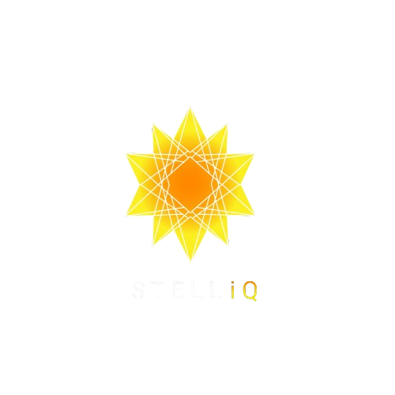

# ARIA — AI-Powered Recording & Intelligent Analysis

<p align="center">
  
</p>

<p align="center">
  <strong>On-device meeting transcription and AI-powered summarization for Android</strong><br/>
  <em>No cloud. No internet. Full pipeline runs in airplane mode.</em>
</p>

<p align="center">
  
  
  
  
  
  
</p>

---

## What is ARIA?

ARIA is an air-gapped Android application that records meetings, transcribes speech in real-time using OpenAI's Whisper model accelerated on the Qualcomm Hexagon NPU, and generates structured After Action Review (AAR) summaries using Meta's Llama 3.1 8B running on the Adreno GPU — all entirely on-device with zero network dependency.

**Target Device:** Samsung Galaxy S24 Ultra (Snapdragon 8 Gen 3, Hexagon V75, Adreno 750, 12GB RAM)

---

## Key Features

- **Fully Air-Gapped** — Complete pipeline runs offline after initial model download. No data ever leaves the device.
- **NPU-Accelerated Transcription** — Whisper small.en encoder runs on Qualcomm's Hexagon V75 NPU via QNN HTP, achieving ~0.3-0.4x real-time factor with 244M parameter accuracy.
- **GPU-Accelerated Summarization** — Llama 3.1 8B Instruct Q4_K_M with all 32 layers offloaded to Adreno 750 via OpenCL. ~25-35 tokens/second decode speed.
- **Structured AAR Output** — Generates JSON-structured summaries with 6 fields: title, what was planned, what happened, why it happened, how to improve, and AI perspective.
- **4 Summary Templates** — Military AAR (TC 7-0.1), Retrospective, Incident Postmortem, and Simple Summary.
- **Real-Time Transcription** — Live transcript display during recording with timestamp markers.
- **Voice Activity Detection** — Silero VAD filters silence to avoid wasting inference cycles.
- **Multi-Device Meeting Support** — TCP-based protocol for connecting multiple ARIA devices to a shared session via NSD discovery.
- **Session History** — Room database stores all sessions with full transcript, summary, and pipeline performance metrics.
- **Export** — Share sessions as formatted text.

---

## Architecture

### Pipeline Overview

```
User taps START
    │
    ▼
AudioCaptureManager ─── 16kHz mono PCM, dedicated capture thread
    │
    ▼
SlidingWindowBuffer ─── 5-second windows, 80Hz high-pass filter
    │
    ▼
SileroVAD ─── ONNX Runtime, CPU, filters silence segments
    │
    ▼
WhisperEngine ─── Encoder: Hexagon NPU (V75 HTP context binary)
    │               Decoder: CPU (autoregressive, ARM NEON)
    │               Model: small.en Q8_0 (244M params, ~488MB)
    │
    ▼
TextPostProcessor ─── Capitalize, collapse whitespace
    │
    ▼
TranscriptAccumulator ─── Dedup overlapping words, [M:SS] timestamps
    │
User taps STOP
    │
    ▼
AARPromptBuilder ─── Llama 3.1 Instruct chat template
    │
    ▼
LlamaEngine ─── Llama 3.1 8B Instruct Q4_K_M (~4.6GB)
    │              Adreno 750 GPU via OpenCL (32 layers offloaded)
    │              TTFT: ~1.2-1.5s, Decode: ~25-35 tok/s
    │
    ▼
AARJsonParser ─── Regex + JSON fallback extraction
    │
    ▼
AARSummary ─── Structured 6-field summary object
    │
    ▼
Room DB ─── AARSession + TranscriptSegment + PipelineMetric
```

### Threading Model

| Thread | Responsibility | Key Class |
|--------|---------------|-----------|
| Main (UI) | UI updates, LiveData observation, service lifecycle | `SessionController` |
| `aria-audio-capture` | AudioRecord loop, 32ms PCM chunks | `AudioCaptureManager` |
| `aria-asr-worker` | Whisper inference (encoder on NPU, decoder on CPU) | `WhisperEngine` |
| `aria-llm-worker` | Llama 3.1 8B inference (GPU) | `LlamaEngine` |
| Room executor | Database writes | `AARRepository` |

### State Machine

```
IDLE → INITIALIZING → RECORDING → SUMMARIZING → COMPLETE
  ▲                                                  │
  └──────────── (reset / new session) ───────────────┘

Any state → ERROR (recoverable) → IDLE
```

---

## Project Structure

```
app/src/main/java/com/stelliq/aria/
├── asr/                    # Audio capture, VAD, Whisper, transcript processing
│   ├── AudioBufferPool       # Reusable PCM buffer pool
│   ├── AudioCaptureManager   # AudioRecord wrapper, capture thread
│   ├── SileroVAD             # ONNX-based voice activity detection
│   ├── SlidingWindowBuffer   # 5s windowed audio buffering with HPF
│   ├── TextPostProcessor     # Capitalization, whitespace normalization
│   ├── TranscriptAccumulator # Deduplication, timestamp formatting
│   └── WhisperEngine         # JNI bridge to whisper.cpp (NPU encoder + CPU decoder)
│
├── llm/                    # LLM prompt building, inference, output parsing
│   ├── AARJsonParser         # JSON extraction from LLM output (regex + fallback)
│   ├── AARPromptBuilder      # Llama 3.1 Instruct prompt construction
│   ├── LlamaEngine           # JNI bridge to llama.cpp (GPU via OpenCL)
│   └── SummaryTemplate       # 4 template definitions (Military, Retro, Incident, Simple)
│
├── db/                     # Room persistence layer
│   ├── AARDatabase           # Room database (version 3)
│   ├── AARRepository         # Data access abstraction
│   ├── dao/                  # DAOs for sessions, segments, metrics
│   └── entity/               # AARSession, TranscriptSegment, PipelineMetric
│
├── service/                # Foreground service and orchestration
│   ├── ARIASessionService    # Foreground service with notification
│   └── SessionController     # State machine, pipeline orchestration
│
├── meeting/                # Multi-device TCP protocol
│   ├── MeetingManager        # Session coordination
│   ├── MeetingServer         # TCP server + NSD advertisement
│   ├── MeetingClient         # TCP client + NSD discovery
│   └── MeetingProtocol       # Wire protocol definition
│
├── model/                  # Data classes
│   ├── AARSummary            # 6-field structured summary
│   ├── ModelDownloadStatus   # Download progress tracking
│   └── SessionState          # State machine enum
│
├── ui/                     # Fragments, activities, views
│   ├── MainActivity          # Single-activity host with Navigation
│   ├── SplashActivity        # Launch screen
│   ├── home/                 # HomeFragment — main dashboard
│   ├── recording/            # RecordingFragment — live transcription UI
│   ├── session/              # SessionDetailFragment — summary + transcript tabs
│   ├── sessions/             # SessionsFragment — history list
│   ├── settings/             # SettingsFragment — template, model, preferences
│   └── view/                 # WaveformView — real-time audio visualization
│
├── viewmodel/              # MVVM bridge
│   └── SessionViewModel      # LiveData for UI state
│
├── util/                   # Constants, logging, notifications
│   ├── Constants             # All configuration values (no magic numbers)
│   ├── ModelFileManager      # Model file extraction and verification
│   ├── PerfLogger            # Pipeline performance instrumentation
│   ├── NotificationHelper    # Notification channel management
│   └── AccessibilityHelper   # A11y support utilities
│
└── export/                 # Session export
    └── AARExporter           # Text/share export formatting
```

### Native Libraries

| Library | Purpose | Inference Target |
|---------|---------|-----------------|
| `libasr_jni.so` | Whisper JNI bridge (whisper.cpp + ggml + QNN backend) | NPU encoder, CPU decoder |
| `libllm_jni.so` | Llama JNI bridge (links prebuilt libllama.so) | GPU (Adreno 750 OpenCL) |
| `libQnnHtp.so` | QNN HTP core runtime | NPU |
| `libQnnHtpPrepare.so` | QNN HTP graph preparation | NPU |
| `libQnnHtpV75Stub.so` | Hexagon V75 device stub (Snapdragon 8 Gen 3) | NPU |
| `libQnnSystem.so` | QNN system library | NPU |
| `libonnxruntime.so` | ONNX Runtime for Silero VAD | CPU |
| `libllama.so` | Prebuilt llama.cpp with OpenCL GPU support | GPU |
| `libggml*.so` | GGML tensor library (base, cpu, opencl) | CPU + GPU |

### AI Models

| Model | File | Size | Inference |
|-------|------|------|-----------|
| Whisper small.en Q8_0 | `ggml-small.en-q8_0.bin` | ~488 MB | CPU decoder + NPU encoder |
| Whisper encoder context binary | `whisper_encoder_s24ultra.bin` | ~177 MB | NPU (V75 HTP) |
| Llama 3.1 8B Instruct Q4_K_M | `aria_llama31_8b_q4km.gguf` | ~4.6 GB | GPU (Adreno 750) |
| Silero VAD v5 | `silero_vad_v5.onnx` | ~2 MB | CPU |

> Models are not included in this repository due to size. See [Model Setup](#model-setup) below.

---

## Summary Templates

ARIA supports 4 summary templates, each producing a structured JSON output with 6 fields:

| Template | Use Case | Key Characteristics |
|----------|----------|-------------------|
| **Military AAR** | TC 7-0.1 After Action Reviews | Military terminology (METT-TC, TLP, OAKOC), doctrinal references, rank-attributed observations |
| **Retrospective** | Sprint retros, quarterly reviews, project postmortems | Root cause analysis, plan vs. reality contrast, actionable recommendations with owners |
| **Incident Postmortem** | Outage reviews, security incidents, system failures | Timeline-based, impact metrics, causal chain analysis, remediation categories |
| **Simple Summary** | General meetings, standups, 1-on-1s | Plain language, concise, practical action items |

### Output Schema

All templates produce this 6-field JSON structure:

```json
{
  "title": "Descriptive Title In Title Case",
  "what_was_planned": "Goals, agenda, objectives, or expected system state",
  "what_happened": "Key events, decisions, outcomes vs. plan",
  "why_it_happened": "Root causes, contributing factors, context",
  "how_to_improve": "Specific actions, owners, timelines",
  "ai_perspective": "Independent analytical assessment — patterns, risks, blind spots"
}
```

The `ai_perspective` field is what distinguishes ARIA from a generic summarizer — it provides candid analytical insight that participants may not have explicitly recognized.

---

## NPU Acceleration (QNN HTP)

ARIA uses Qualcomm's QNN (Qualcomm Neural Network) SDK to offload the Whisper encoder to the Hexagon V75 NPU. This is a hybrid inference approach:

- **Encoder** (compute-heavy, parallelizable) → Hexagon V75 NPU via HTP context binary
- **Decoder** (sequential, autoregressive) → CPU (ARM Cortex-X4, NEON)

### Why Hybrid?

The Whisper encoder processes a fixed-size mel spectrogram `(1, 80, 3000)` through self-attention layers — highly parallel and perfect for NPU acceleration. The decoder generates tokens one at a time with dynamic control flow (beam search, KV cache), which NPUs handle poorly. The hybrid approach gives us NPU-class throughput on the encoder while keeping decoder flexibility on CPU.

### QNN Library Load Order (Critical)

```java
static {
    try { System.loadLibrary("cdsprpc"); } catch (UnsatisfiedLinkError e) { }
    System.loadLibrary("QnnHtpPrepare");  // Must be before QnnHtp
    System.loadLibrary("QnnHtp");          // Must be before asr_jni
    System.loadLibrary("asr_jni");         // Depends on QnnHtp symbols
}
```

Wrong order causes silent CPU fallback with zero errors — the most common deployment failure.

---

## Performance

| Metric | Target | Expected on S24 Ultra |
|--------|--------|-----------------------|
| Whisper RTF (NPU encoder) | ≤ 0.5x | ~0.3-0.4x |
| LLM TTFT (GPU) | ≤ 2.0s | ~1.2-1.5s |
| LLM decode speed | ≥ 20 tok/s | ~25-35 tok/s |
| Peak RAM | < 10 GB | ~9.3 GB |
| End-to-end (15-min meeting) | ≤ 60s | ~45-55s |

### RAM Allocation

| Component | Estimated |
|-----------|-----------|
| Android 14 + One UI 6 | ~3.0 GB |
| ARIA APK + UI | ~150 MB |
| Whisper small.en + QNN runtime | ~600 MB |
| Llama 3.1 8B Q4_K_M (GPU) | ~5.5 GB |
| SQLite + audio buffers | ~50 MB |
| **Total Peak** | **~9.3 GB** (12 GB device) |

---

## Building

### Prerequisites

- Android Studio (with NDK and CMake)
- Java 17+ (JBR bundled with Android Studio)
- QNN SDK v2.44.0 (`libQnnHtp.so`, `libQnnHtpPrepare.so`, `libQnnHtpV75Stub.so`, `libQnnSystem.so`)
- Prebuilt native libraries (see [Native Library Setup](#native-library-setup))
- AI models (see [Model Setup](#model-setup))

### Build Commands

```bash
# Build debug APK
cmd.exe //c "set JAVA_HOME=C:\Program Files\Android\Android Studio1\jbr&& .\gradlew.bat assembleDebug"

# Run unit tests (205 tests, 10 test files)
cmd.exe //c "set JAVA_HOME=C:\Program Files\Android\Android Studio1\jbr&& .\gradlew.bat testDebugUnitTest"

# Install to device
adb install -r app/build/outputs/apk/debug/app-debug.apk

# Launch
adb shell am start -W -n com.stelliq.aria/.ui.SplashActivity
```

### Native Library Setup

Place the following in `app/src/main/jniLibs/arm64-v8a/`:

**QNN SDK** (from `qualcomm.com/software-center`, QNN SDK v2.44.0):
- `libQnnHtp.so`
- `libQnnHtpPrepare.so`
- `libQnnHtpV75Stub.so` — must match device SoC (V75 for Snapdragon 8 Gen 3)
- `libQnnSystem.so`

**llama.cpp** (build from source with OpenCL support):
- `libllama.so`, `libggml.so`, `libggml-base.so`, `libggml-cpu.so`, `libggml-opencl.so`
- `libc++_shared.so`, `libomp.so`

**ONNX Runtime** (for Silero VAD):
- `libonnxruntime.so`, `libonnxruntime4j_jni.so`

> Do NOT include `libcdsprpc.so` — this is loaded from the vendor partition via `<uses-native-library>` in the manifest.

### Model Setup

Models must be obtained separately due to their size:

1. **Whisper small.en Q8_0** (~488 MB) → Place in `app/src/main/assets/models/`
   - Source: [ggml Whisper models](https://huggingface.co/ggerganov/whisper.cpp)

2. **Whisper encoder context binary** (~177 MB) → Place in `app/src/main/assets/models/`
   - Compiled via Qualcomm AI Hub for Samsung Galaxy S24 Ultra (V75)

3. **Llama 3.1 8B Instruct Q4_K_M** (~4.6 GB) → Downloaded to device at runtime
   - Source: [bartowski/Meta-Llama-3.1-8B-Instruct-GGUF](https://huggingface.co/bartowski/Meta-Llama-3.1-8B-Instruct-GGUF)

4. **Silero VAD v5** (~2 MB) → Place in `app/src/main/assets/models/`
   - Source: [snakers4/silero-vad](https://github.com/snakers4/silero-vad)

### Verifying NPU Delegation

After installing on a Snapdragon 8 Gen 3 device:

```bash
# Must show HTP delegation count > 0
adb logcat | grep -E "HTP|QNN|delegation|hexagon|V75"

# Must show GPU layer offload
adb logcat | grep -E "llama|ggml|opencl|gpu_layers|offload"
```

If delegation count = 0, check: library load order, V75 stub version, `.so` file presence, and `ADSP_LIBRARY_PATH`.

---

## Testing

205 unit tests across 10 test files:

| Test File | Tests | Coverage |
|-----------|-------|----------|
| `SlidingWindowBufferTest` | Audio windowing, HPF, edge cases | `asr/` |
| `TextPostProcessorTest` | Capitalization, whitespace, punctuation | `asr/` |
| `TranscriptAccumulatorTest` | Dedup, timestamps, accumulation | `asr/` |
| `WhisperEngineHallucinationTest` | Hallucination detection and filtering | `asr/` |
| `AARJsonParserTest` | JSON extraction, malformed input, fallbacks | `llm/` |
| `AARPromptBuilderTest` | Prompt structure, Llama 3.1 tokens, truncation | `llm/` |
| `AARSummaryTest` | Summary model, field validation | `model/` |
| `SessionStateTest` | State machine transitions | `model/` |
| `WaveformViewTest` | Waveform rendering calculations | `ui/` |
| `AccessibilityHelperTest` | A11y content descriptions | `util/` |

NPU/GPU inference verification requires a physical Samsung Galaxy S24 Ultra.

---

## Fine-Tuning

ARIA includes a fine-tuning pipeline (`aria-fine-tune/`, separate repository) for training a custom Llama 3.1 8B model optimized for ARIA's 6-field summary schema:

- **160 training examples** across 4 templates (40% Military, 20% Retro, 20% Incident, 20% Simple)
- **QLoRA** via Unsloth on RTX 5080 Mobile (16GB VRAM)
- **Export** to GGUF Q4_K_M for on-device deployment

---

## Database Schema

Room database version 3 with three entities:

- **AARSession** — Session metadata, transcript, summary JSON, pipeline timing
- **TranscriptSegment** — Individual timestamped transcript segments
- **PipelineMetric** — Per-session performance metrics (RTF, TTFT, tok/s)

---

## Configuration

All tunable parameters are centralized in `Constants.java`:

| Parameter | Value | Purpose |
|-----------|-------|---------|
| `AUDIO_SAMPLE_RATE_HZ` | 16000 | Whisper input requirement |
| `WINDOW_SAMPLES` | 80000 (5s) | Transcription window size |
| `WHISPER_THREADS` | 4 | Decoder CPU threads (Cortex-X4) |
| `LLM_GPU_LAYERS` | 32 | Full Adreno 750 offload |
| `LLM_CONTEXT_TOKENS` | 4096 | Llama 3.1 context window |
| `LLM_TEMPERATURE` | 0.1 | Low randomness for structured JSON |
| `MAX_TRANSCRIPT_CHARS` | 13600 | Prevents context overflow |

---

## License

Proprietary — STELLiQ Technologies. All rights reserved.

---

<p align="center">
  <strong>STELLiQ Technologies</strong><br/>
  <em>Building intelligent tools for the edge.</em>
</p>
